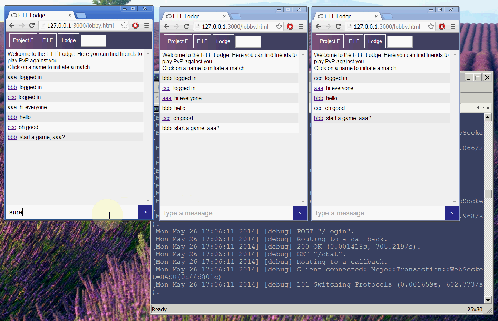

#F.Lobby

### HTML5 player-vs-player chatroom + game server in Perl & node.js

# Usage (Perl)

1
install [mojolicious](http://mojolicio.us/)
```
$ curl get.mojolicio.us | sh
```

2
start the server
```
morbo lobby.pl
```

3
go to
```
http://127.0.0.1:3000/lobby.html
```

# Usage (node.js)

1
install [node.js](http://nodejs.org/)
```
npm install
```

2 start the server
```
node lobby.js
```

3
go to
```
http://127.0.0.1:8080/lobby.html
```

# Integrate it into your game

Look at bvb.html for example
```
network.setup_peer(host,active,id1,id2)
network.setInterval(frame,1000/30)
function frame(time,data)
{
	//apply the data received from other side...
	return {x,y,health}; //return data to the other side
}
```

Change lobby.html
```
var play_this_game = 'your_game.html';
```

# Documentation
- [project report](http://tyt2y3.github.io/F.Lobby/project%20report%20updated.pdf)
- [presentation slides](http://tyt2y3.github.io/F.Lobby/project%20slides.pdf)

# Notes
- Works on all major browsers including mobile!
- This was originally a project submitted to comp2021 on Spring 2014 in HKUST and was selected as one of the Best 3 projects

# Screenshot

[Demo video](https://www.youtube.com/watch?v=0x-9Ul3iwHo)

# License

Copyright (c) 2014 Tsang Hao Fung

Permission is hereby granted, free of charge, to any person obtaining a copy of this software and associated documentation files (the "Software"), to deal in the Software without restriction, including without limitation the rights to use, copy, modify, merge, publish, distribute, sublicense, and/or sell copies of the Software, and to permit persons to whom the Software is furnished to do so, subject to the following conditions:

The above copyright notice and this permission notice shall be included in all copies or substantial portions of the Software.

THE SOFTWARE IS PROVIDED "AS IS", WITHOUT WARRANTY OF ANY KIND, EXPRESS OR IMPLIED, INCLUDING BUT NOT LIMITED TO THE WARRANTIES OF MERCHANTABILITY, FITNESS FOR A PARTICULAR PURPOSE AND NONINFRINGEMENT. IN NO EVENT SHALL THE AUTHORS OR COPYRIGHT HOLDERS BE LIABLE FOR ANY CLAIM, DAMAGES OR OTHER LIABILITY, WHETHER IN AN ACTION OF CONTRACT, TORT OR OTHERWISE, ARISING FROM, OUT OF OR IN CONNECTION WITH THE SOFTWARE OR THE USE OR OTHER DEALINGS IN THE SOFTWARE.